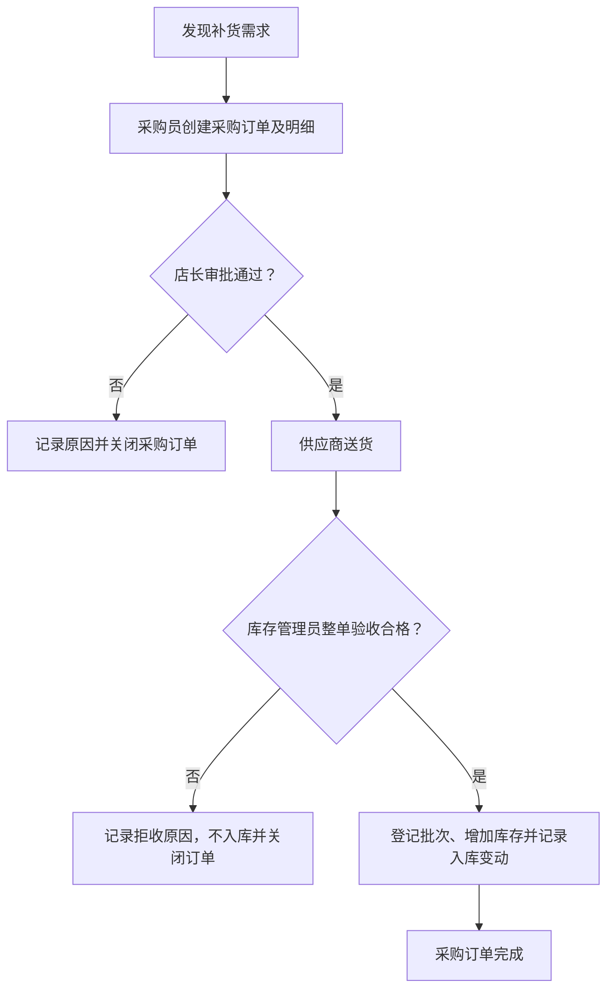
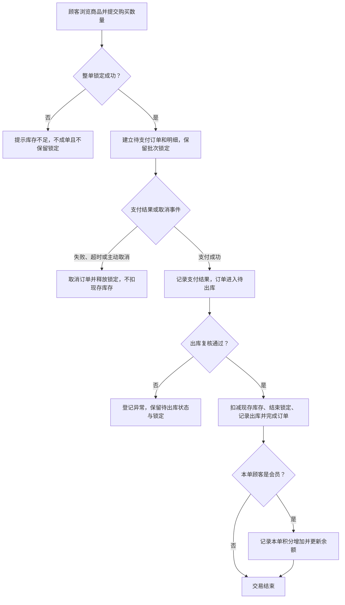
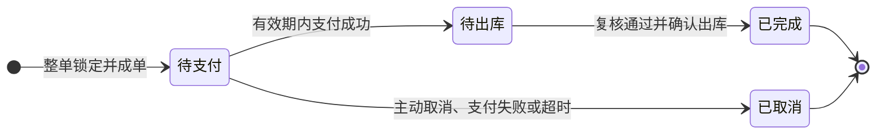

# Week1 - 线上零食网店业务需求分析

## 1. 本周目标与课程边界

依据[第一周任务讲解](第一周任务讲解.md)，本周确定经营场景、角色职能、业务流程和数据边界，为同一项目的 17 周实验建立业务基线。**本周不写 SQL、不建表**；下文的数据对象、状态和规则是需求约定，尚未实现，关系模式与字段定义留到第 2 周。

### 分组与协作

课程要求 2–3 人共用一个 Git 仓库。本项目仓库已建立，成员与实际分工尚待小组填写；经营岗位不等于组员分工，一名组员可以承担多个任务。

| 成员 | 本周负责内容 | 实际贡献与复核记录 |
| --- | --- | --- |
| 待填写：成员 1 | 待分配 | 待填写 |
| 待填写：成员 2 | 待分配 | 待填写 |
| 如有第 3 人则填写，否则删除此行 | 待分配 | 待填写 |

## 2. 经营场景与范围

本项目以**线上零食网店**为固定场景，覆盖采购、库存、销售和会员积分累计，并以商品批次管理保质期。保持这一场景贯穿学期，逐步扩展经营分析和预测驱动补货。

为控制复杂度，第一阶段采用以下业务约定，供小组复核；它们是本项目的简化选择，并非课程额外要求：

- 单店、单仓库、人民币计价；每一种可独立销售的品牌与规格组合视为一个商品，数量按该商品的最小销售单位计整数。
- 顾客下单时有可识别的顾客记录；会员是顾客的一种身份，普通顾客也可购买。第一阶段只累计积分，暂不兑换积分或计算会员折扣。
- 一张采购订单对应一个供应商；采用整单验收、一次入库，暂不支持分批到货或部分验收。一次到货可包含多个商品批次。
- 一张销售订单可含多种商品；整单锁定库存、整单支付和整单出库，暂不拆单。支付用实验数据模拟，每单最多一次成功支付，不接入真实支付接口。
- 以“确认出库”作为本阶段交易完成标志；配送采用人工交接，仅保留必要的收货信息，不实现运费、物流轨迹或签收状态。
- 顾客只能在待支付时取消；支付明确失败或超时未支付也取消。已支付订单不走普通取消流程，退款、退货及积分撤销留待以后扩展。

## 3. 经营参与者及职责

| 参与者 | 主要职责 | 后续权限设计的业务边界 |
| --- | --- | --- |
| 店长 | 商品定价、员工与岗位管理、采购审批、查看经营统计 | 可审批采购和查看全店汇总；历史交易应保留 |
| 采购员 | 维护供应商资料、创建采购订单、跟踪到货 | 可维护采购业务，不能代替店长审批或确认入库 |
| 库存管理员 | 验收与入库、按订单出库、盘点、临期检查和报损 | 可执行库存操作并记录原因，不能直接改销售价格和支付结果 |
| 订单管理员 | 查看与处理订单、核对模拟支付结果、处理允许的取消、登记异常 | 可处理订单，出库由库存管理员确认；无权直接修改库存或积分余额 |
| 普通顾客 | 浏览商品、提交订单、支付、查看和取消自己的待支付订单 | 仅访问自己的订单和收货资料 |
| 会员 | 具有普通顾客能力，另可查看自己的积分余额与变动 | 不能自行增加积分；本阶段不支持积分兑换 |
| 供应商 | 接收采购需求、提供商品与批次资料 | 本阶段由采购员录入资料，不提供供应商登录入口 |

以上是业务角色，尚不是数据库账户或已实现的权限；员工岗位与具体授权在后续实验中细化。积分计算、库存可用量检查等由系统规则执行。

## 4. 核心数据对象

此处描述需要记录的业务信息，不预先确定表结构、主外键或最终 ER 模型。

| 对象 | 需要记录的信息与关联 |
| --- | --- |
| 商品、商品类别 | 名称、品牌、规格、销售单位、类别、当前售价、在售状态和库存预警值；一个类别可包含多个商品 |
| 供应商 | 供货方基本资料、联系方式及合作状态；关联其采购订单 |
| 员工、员工角色 | 员工资料和岗位；业务操作关联实际经办员工，便于责任追溯 |
| 采购订单、采购明细 | 供应商、申请与审批信息、状态；明细记录商品、采购数量和采购成交单价 |
| 库存批次 | 对应商品、到货来源、供应商批号、生产日期、到期日期、现存数量与可售状态；同一商品可有多个批次 |
| 库存锁定记录 | 关联销售订单明细、库存批次与锁定数量，记录锁定、释放或转出库；一条明细可能从多个批次取货 |
| 库存变动记录 | 记录入库、销售出库、盘点调整和报损的批次、数量变化、原因、业务来源、经办人与时间 |
| 顾客、会员 | 顾客身份及必要联系方式；会员资格、加入时间和积分余额，同一顾客的订单仍归属于同一身份 |
| 销售订单、销售明细 | 顾客、下单时间、状态、完成时间和下单时的收货信息；明细保存商品、购买数量与成交单价 |
| 支付记录 | 关联销售订单、模拟交易编号、金额、状态与时间；将来接入支付平台时只保存必要结果 |
| 积分变动记录 | 关联会员与完成订单，保存增加数量、计算依据、原因和时间，支持核对余额 |

库存锁定与实物出入库是两类业务事件：锁定只占用可售数量，不减少现存数量；出库才减少现存数量，并结束对应锁定。

## 5. 业务流程

### 5.1 采购与入库

库存不足、达到预警值或人工发现补货需求后，采购员创建采购订单，店长审批，供应商送货，库存管理员验收。整单验收合格才登记批次、增加库存并完成采购订单。预警值仅作为补货提示，第一阶段由人工决定是否采购。

验收检查商品、数量、批次和有效日期；过期或日期不合法的商品不得入库。拒收后仍需补货时另建采购订单，保留原单及原因；采购退货和部分收货不在当前范围。

### 5.2 销售、出库与积分

顾客提交商品与数量后，系统检查可售库存；整单锁定成功才建立待支付订单及明细。库存不足则拒绝本次下单，不留下部分锁定。成功支付后由库存管理员复核并确认出库，完成交易；若顾客是会员，同步按本单实付金额累计积分。

第一阶段暂定待支付有效期为 15 分钟；支付失败需重新下单。超时由实验操作触发检查，后续再考虑定时执行。模拟支付仅允许作用于仍有效的待支付订单。真实支付回调、取消与支付竞争、延迟到账等问题留待接入支付接口时设计。

出库复核发现过期或实物不足时，订单管理员登记原因，库存管理员核实后可换锁同一商品的合格批次；只有整单恢复可出库条件才可继续完成。无法履约则保持异常记录，不能虚记完成或套用未支付取消；退款解决路径属于后续扩展，第一阶段异常处置止于登记和暂停履约。

### 5.3 销售订单状态

异常待出库订单仍处于“待出库”，附有异常原因，并不自动完成或取消。已完成和已取消均为本阶段终态，历史记录继续保留。付款成功本身不代表交易完成，也不触发赠送积分。

## 6. 数据边界

### 进入数据库的数据

| 数据 | 进入数据库的理由 |
| --- | --- |
| 商品、类别、售价、在售状态和预警值 | 支持商品展示、分类统计和人工补货判断 |
| 供应商、员工及角色资料 | 支持采购来源、经办人追溯和后续权限控制 |
| 采购订单、明细及审批与验收结果 | 记录订货数量、采购成本、到货状态和拒收原因 |
| 库存批次、锁定及库存变动 | 区分现存与可售数量，追踪有效日期和出入库，防止重复占用 |
| 销售订单、明细及状态时间 | 保存历史成交价格与数量，为订单查询和日销量统计提供依据 |
| 下单时的收货人、联系方式与地址 | 支持人工配送交接，避免顾客修改个人资料后改变历史订单的收货信息 |
| 顾客、会员和积分变动 | 支持身份识别、会员积分累计与核对 |
| 必要支付结果与交易编号 | 判断是否允许出库、核对实付金额，不保存支付凭据秘密 |
| 订单异常原因及处理记录 | 说明为何暂停出库及由谁处理，避免将异常订单误算为完成销售 |

### 暂不进入数据库的数据或功能

| 数据或功能 | 暂不进入的理由 |
| --- | --- |
| 完整银行卡、支付密码和支付密钥 | 不属于实验业务数据，真实支付认证由支付平台处理 |
| 商品图片文件 | 数据库可保存图片地址，图片文件由文件系统或对象存储管理 |
| 供应商或顾客配送的实时物流轨迹 | 本阶段只关心验收入库与确认出库，不建设物流系统 |
| 聊天记录、广告点击数据和推荐系统 | 不属于采购、库存与销售的最小闭环 |
| 积分兑换、会员折扣和优惠券 | 会引入抵扣、优惠分摊与撤销规则，第一阶段先完成积分累计 |
| 退款、退货、采购退货和拆单 | 涉及逆向资金、库存、积分及部分履约，暂不实现 |
| 销量预测、预测结果及自动补货 | 属于第 4 阶段任务；本阶段保存真实业务含义的销售与库存信息作为基础 |

实验样例使用虚构的姓名、联系方式和地址，不把真实顾客资料提交到代码仓库。

## 7. 初步业务规则

以下编号用于后续关系模式、约束、事务和验证记录引用；当前只约定业务含义。

| 编号 | 规则 |
| --- | --- |
| R01 | 采购与销售订单均至少包含一条明细；同一订单内同一商品合并数量，数量为正整数，成交单价为正数。 |
| R02 | 成交单价保存在订单明细中，后续商品调价不得改变历史成交金额。订单总额为各明细“数量 × 成交单价”之和；本阶段不含运费和优惠，成功支付金额必须等于订单总额，金额按人民币分计算。 |
| R03 | 每批现存量与有效锁定量均不小于零，有效锁定量不超过现存量。可售批次的可用量 = 现存量 − 有效锁定量；过期、隔离或停售商品的批次不参与新订单分配，商品可售量为合格批次可用量之和。 |
| R04 | 生产日期不得晚于验收当天，到期日期必须晚于生产日期；按项目约定，到期日当天起禁止入库、锁定和出库。按较早到期批次优先分配，出库前再次复核；过期不会使账面现存量自动归零，实物报损另记库存变动。 |
| R05 | 整单库存锁定与成单共同成功或失败。取消只释放仍有效的锁定；出库同时减少现存量和对应锁定量，不可再对同一订单重复扣库存。更换批次也须整单保持库存约束。 |
| R06 | 销售订单只沿状态图转换；仅有效的待支付订单可接受成功支付，每单最多一笔成功支付。重复提交支付结果不能重复完成订单、出库或加积分。 |
| R07 | 仅完成时具备会员身份的顾客获得积分，暂定每实付满 1 元积 1 分，按整单实付金额向下取整；不足 1 元不产生积分。每单最多一次赠分，保存当次计算依据，规则调整不得重算历史积分。 |
| R08 | 入库、销售出库、盘点调整与报损都必须记录来源、批次、数量、原因、经办人与时间。盘亏涉及已锁定货物时先登记异常并处理锁定，不能直接把现存量调到锁定量以下。 |
| R09 | 只有审批通过且整单验收合格的采购订单才能入库；同一采购订单不能重复入库，入库数量与已验收明细一致。 |
| R10 | 完成销售时，订单状态、库存变动和应赠积分必须一致；任何一步失败不能留下部分完成结果。后续事务实验验证这一要求，第一周流程图仅表达业务顺序。 |
| R11 | 已有历史业务引用的商品、供应商、顾客和员工资料应通过停售、停用等方式维护；不能因删除基础资料而失去历史订单、库存或积分的追溯依据。 |

## 8. 业务走查示例与后续验证

下表是**需求层面的手工推演与未来验证目标**，不是已执行的数据库测试。样例相互独立；除特别说明外，商品可售、批次未过期且没有其他订单占用。

| 场景 | 初始条件与操作 | 预期结果 | 对应规则 |
| --- | --- | --- | --- |
| 采购入库及重复操作 | 某商品现存 0 包；审批并验收 20 包后入库，再次确认同一采购订单 | 首次现存变为 20，有一笔入库变动；重复确认不再增加库存 | R08、R09 |
| 会员正常购买 | 某批现存 10 包、锁定 0 包；会员买 2 包，每包 6.50 元，支付 13.00 元并出库 | 锁定后现存 10、锁定 2、可用 8；完成后现存 8、锁定 0，本单增加 13 分 | R02、R03、R05、R07、R10 |
| 待支付取消 | 某批现存 10 包、锁定 2 包，全部锁定来自本单；本单未支付即取消 | 现存仍为 10、锁定变为 0、可用恢复为 10，不产生出库或积分 | R05、R06、R07 |
| 多商品中一项缺货 | 本单买 A、B 各 2 件；A 足够，B 只有 1 件可用 | 整单不成立，A、B 均不保留本次锁定 | R03、R05 |
| 批次到期 | 某批现存 5 包、无锁定，但当天已到期；顾客尝试购买 | 该批贡献的可售量为 0，不得分配；报损前现存仍为 5 | R03、R04、R08 |
| 历史调价与重复支付 | 已有成交单价 6.50 元的完成订单；商品调价到 7.00 元后重复提交原支付结果 | 历史单价和金额不变，不再次出库或赠分 | R02、R05、R06、R07 |
| 已付款但无法出库 | 已支付订单锁定批次在复核时发现实物不足，暂时没有替代批次 | 保持待出库并登记异常，不虚记完成、不赠分、不按未付款取消处理 | R03、R06、R08、R10 |
| 完成操作中途失败 | 后续实现中模拟出库成功后积分写入失败 | 整次完成操作回滚到原待出库状态，库存、锁定、出库记录和积分均无部分提交 | R10 |

## 9. 后续阶段如何沿用本周成果

| 时间与版本 | 沿用的业务基础 | 后续要完成的工作 |
| --- | --- | --- |
| 第 2–4 周，v0.1 | 本周对象、角色、流程与规则 | 使用 SQL Server 定义关系模式、属性域及键，准备样例元组，完成可复现建库、CRUD、连接查询、视图、约束和权限验证 |
| 第 5–9 周，v1.0 | 采购与销售的主从记录、批次和顾客会员关系 | 用 ER 模型与规范化审查初版模式，保留重构依据，验证迁移前后数据，并开发应用界面 |
| 第 10–13 周，v2.0 | R05、R06、R09、R10 的一致性要求 | 完成数据库程序对象、高级查询、订单和补货事务，记录正常提交、失败回滚、锁等待、隔离现象和死锁实验 |
| 第 14–17 周，v3.0 | 完成订单的商品、数量、成交金额、完成时间及采购库存历史 | 构建日销量数据集与自然语言转 SQL 记录，完成线性回归预测、预测结果入库及预测驱动补货；销量按完成日期统计，排除取消与未完成订单 |

具体实现和提交要求以对应周 PPT 为准。第一周不提前固定最终表结构或数据库程序实现；每阶段应保存环境与复现步骤、测试证据、报告、AI 使用记录和实际组内分工。

## 10. 本周提交自查

- [x] 场景固定为线上零食网店，包含商品、库存、订单、明细、会员与员工。
- [x] 给出经营角色与职能，以及从顾客下单到完成交易的流程。
- [x] 列出进库与暂不进库的信息及理由。
- [x] 明确业务假设、异常边界和后续阶段衔接，未编写 SQL 或建表。
- [x] 保留本轮 [AI 使用记录](AI使用记录.md)，区分 AI 草稿、验证和人工复核状态。
- [ ] 小组填写 2–3 名成员、实际分工与贡献。
- [ ] 每位成员复核业务假设，记录实际人工修改，并能解释库存锁定、积分和取消规则；完成后再勾选。
