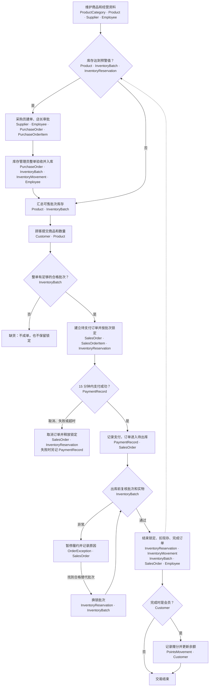

# Week2 - 线上零食网店关系模式设计

## 1. 范围与读法

本版是第二周的**关系模式草案**，沿用第一周的线上零食网店、单店单仓、整单验收、批次保质期、整单锁定与出库、模拟支付、完成后累计积分等业务约定。第一阶段不处理退款、退货、运费、优惠、拆单和积分兑换。表、字段与样例尚未执行 SQL；小组仍需人工复核第一周的假设。本版的“真实样例”指符合业务规律的**虚构测试数据**，不使用真实顾客或员工资料。

数据类型按 SQL Server 记法：`VARCHAR(n)`/`NVARCHAR(n)` 的 `n` 是最大字符数，`DECIMAL(10,2)` 的总精度为 10、小数位为 2，`DATETIME2(0)` 精确到秒。金额单位为人民币元，数量为商品的最小销售单位，数据库值不带“元、包、瓶”等字。`NULL` 是数据库空值，`无`表示不设默认值；下列业务范围在第三、四周逐步用约束、程序或事务验证。

主码本身属于候选码；“其他 UNIQUE 候选”只列额外的稳定唯一键。样例是**同一组贯通数据**，不是每张表相互独立的例子。多数表给出 2–3 行；销售明细、锁定和库存变动为完整展示多商品订单与出入库链路，列出更多行。下面每个字段表均给出类型、长度或精度、空值、默认值、域、含义和码。

### 店铺运营流程与表的对应

图中每个环节下方列出参与的表。箭头表示业务先后或分支，不表示数据库外码；具体主外码见后面的字段定义。库存不足时**不成单**，整单锁定与建立待支付订单同时成功或失败。虚线表示销售出库后再次检查补货预警。

支付成功但复核失败时，订单仍是“待出库”，不能重复扣库存或先赠积分；若找不到替代批次，就停在异常处理环节，不假装已完成或按未支付订单取消。`InventoryMovement` 同时记录采购入库和销售出库，`InventoryReservation` 只记录占用或释放，两者不能混为一张表。

## 2. 商品类别 ProductCategory

| 字段名 | 类型 | 长度/精度 | 允许空 | 默认值 | 域或取值范围 | 码 | 含义 |
| --- | --- | --- | --- | --- | --- | --- | --- |
| CategoryID | VARCHAR | 12 字符 | 否 | 无 | 非空类别编号 | PK | 类别标识 |
| CategoryName | NVARCHAR | 40 字符 | 否 | 无 | 非空；同名类别不重复 | UNIQUE 候选 | 展示与统计用类别名称 |
| Description | NVARCHAR | 200 字符 | 是 | NULL | 可为空的文字说明 | — | 类别边界说明 |

**码：**PK=`CategoryID`；其他 UNIQUE 候选=`CategoryName`；FK=无。

| CategoryID | CategoryName | Description |
| --- | --- | --- |
| CAT00 | 辣味零食 | 辣条等独立包装零食 |
| CAT01 | 饮品 | 独立瓶装或罐装饮料 |
| CAT02 | 膨化与米饼 | 雪饼等袋装零食 |

## 3. 商品 Product

不在商品主档存总库存余量；当前现存量来自该商品各批次 `OnHandQty` 的合计，当前可售量还需扣除有效锁定，并排除到期、隔离或停售批次。

| 字段名 | 类型 | 长度/精度 | 允许空 | 默认值 | 域或取值范围 | 码 | 含义 |
| --- | --- | --- | --- | --- | --- | --- | --- |
| ProductID | VARCHAR | 12 字符 | 否 | 无 | 非空商品编号 | PK | 独立销售 SKU 标识 |
| CategoryID | VARCHAR | 12 字符 | 否 | 无 | 必须存在于 `ProductCategory.CategoryID` | FK → ProductCategory.CategoryID | 商品类别 |
| ProductName | NVARCHAR | 100 字符 | 否 | 无 | 非空名称 | 组合 UNIQUE 候选的一部分 | 商品销售名称 |
| Brand | NVARCHAR | 60 字符 | 否 | 无 | 非空品牌 | 组合 UNIQUE 候选的一部分 | 商品品牌 |
| Specification | NVARCHAR | 60 字符 | 否 | 无 | 非空规格，例如 `30g` | 组合 UNIQUE 候选的一部分 | 最小销售单位对应的净含量或包装规格 |
| SaleUnit | NVARCHAR | 10 字符 | 否 | 无 | 如 `包`、`瓶`、`袋` | 组合 UNIQUE 候选的一部分 | 库存和订单数量的计量单位 |
| CurrentPrice | DECIMAL | 10,2 | 否 | 无 | >0 | — | 当前售价；历史成交价另存于销售明细 |
| SaleStatus | NVARCHAR | 10 字符 | 否 | `在售` | `在售`、`停售` | — | 能否接受新订单 |
| ReorderLevel | INT | 32 位整数 | 否 | 0 | 整数且 ≥0 | — | 人工补货预警阈值，按最小销售单位计 |

**码：**PK=`ProductID`；其他 UNIQUE 候选=`(Brand, ProductName, Specification, SaleUnit)`，以小组确认“相同组合只登记一个 SKU”为前提；FK=`CategoryID → ProductCategory.CategoryID`。

| ProductID | CategoryID | ProductName | Brand | Specification | SaleUnit | CurrentPrice | SaleStatus | ReorderLevel |
| --- | --- | --- | --- | --- | --- | ---: | --- | ---: |
| S00 | CAT00 | 卫龙大面筋 | 卫龙 | 30g | 包 | 2.00 | 在售 | 100 |
| S01 | CAT01 | 百事可乐罐装 | 百事 | 330ml | 瓶 | 4.40 | 在售 | 80 |
| S02 | CAT02 | 旺旺雪饼 | 旺旺 | 84g | 袋 | 5.50 | 在售 | 20 |

## 4. 供应商 Supplier

供应商名称可能改名或重名，不把名称强行视为候选码。

| 字段名 | 类型 | 长度/精度 | 允许空 | 默认值 | 域或取值范围 | 码 | 含义 |
| --- | --- | --- | --- | --- | --- | --- | --- |
| SupplierID | VARCHAR | 12 字符 | 否 | 无 | 非空供应商编号 | PK | 供应商稳定标识 |
| SupplierName | NVARCHAR | 100 字符 | 否 | 无 | 非空名称 | — | 供货方名称 |
| ContactName | NVARCHAR | 40 字符 | 是 | NULL | 可为空的联系人姓名 | — | 采购沟通联系人 |
| ContactPhone | VARCHAR | 20 字符 | 是 | NULL | 如填写，按电话号码字符串保存 | — | 联系方式，不参与数值计算 |
| CooperationStatus | NVARCHAR | 10 字符 | 否 | `合作中` | `合作中`、`已停用` | — | 能否新建采购订单 |

**码：**PK=`SupplierID`；其他 UNIQUE 候选=暂无；FK=无。

| SupplierID | SupplierName | ContactName | ContactPhone | CooperationStatus |
| --- | --- | --- | --- | --- |
| SUP00 | 粤邻食品批发部（模拟） | 测试联系人甲 | NULL | 合作中 |
| SUP01 | 南城零食供货部（模拟） | 测试联系人乙 | NULL | 合作中 |

## 5. 员工 Employee

`Position` 是经营岗位，不等于 SQL Server 数据库角色；第四周仍需单独设计授权。

| 字段名 | 类型 | 长度/精度 | 允许空 | 默认值 | 域或取值范围 | 码 | 含义 |
| --- | --- | --- | --- | --- | --- | --- | --- |
| EmployeeID | VARCHAR | 12 字符 | 否 | 无 | 非空员工编号 | PK | 员工稳定标识 |
| EmployeeName | NVARCHAR | 40 字符 | 否 | 无 | 非空姓名，允许重名 | — | 员工显示名 |
| Position | NVARCHAR | 20 字符 | 否 | 无 | `店长`、`采购员`、`库存管理员`、`订单管理员` | — | 当前主要岗位 |
| HireDate | DATE | 日期 | 否 | 无 | 合法日期，不晚于录入日 | — | 入职日期 |
| MonthlySalary | DECIMAL | 10,2 | 否 | 无 | ≥0，单位元/月 | — | 样例中的约定月薪 |
| ContactPhone | VARCHAR | 20 字符 | 是 | NULL | 可为空的电话号码字符串 | — | 员工联系方式 |
| ActiveStatus | NVARCHAR | 10 字符 | 否 | `在职` | `在职`、`离职` | — | 历史业务保留员工引用，离职不删行 |

**码：**PK=`EmployeeID`；其他 UNIQUE 候选=暂无，姓名与电话均不保证稳定唯一；FK=无。

| EmployeeID | EmployeeName | Position | HireDate | MonthlySalary | ContactPhone | ActiveStatus |
| --- | --- | --- | --- | ---: | --- | --- |
| P00 | 王明 | 库存管理员 | 2025-06-01 | 4800.00 | NULL | 在职 |
| P01 | 李晓 | 店长 | 2025-08-15 | 6500.00 | NULL | 在职 |
| P02 | 陈禾 | 采购员 | 2026-03-01 | 5000.00 | NULL | 在职 |

## 6. 顾客 Customer

积分变动表保留加分事实；`PointsBalance` 是便于查询的当前余额，完成订单时须与积分变动在同一事务更新。样例中的姓名、联系方式和地址均为虚构测试数据。

| 字段名 | 类型 | 长度/精度 | 允许空 | 默认值 | 域或取值范围 | 码 | 含义 |
| --- | --- | --- | --- | --- | --- | --- | --- |
| CustomerID | VARCHAR | 12 字符 | 否 | 无 | 非空顾客编号 | PK | 顾客稳定标识 |
| AccountName | NVARCHAR | 40 字符 | 否 | 无 | 非空且唯一 | UNIQUE 候选 | 登录账号，不是姓名 |
| CustomerName | NVARCHAR | 40 字符 | 否 | 无 | 非空显示名，允许重名 | — | 顾客称呼 |
| ContactPhone | VARCHAR | 20 字符 | 是 | NULL | 可为空的电话字符串 | — | 顾客当前联系方式；不代替订单收货快照 |
| IsMember | BIT | 1 位 | 否 | 0 | 0=普通顾客，1=会员 | — | 当前会员身份 |
| JoinedAt | DATETIME2 | 秒精度 0 | 是 | NULL | 会员须有加入时间；普通顾客为空 | — | 成为会员的时间 |
| PointsBalance | INT | 32 位整数 | 否 | 0 | 整数且 ≥0；普通顾客为 0 | — | 当前积分余额，须与积分变动合计一致 |
| ActiveStatus | NVARCHAR | 10 字符 | 否 | `正常` | `正常`、`停用` | — | 停用账号但保留历史订单 |

**码：**PK=`CustomerID`；其他 UNIQUE 候选=`AccountName`；FK=无。`IsMember=0` 时 `JoinedAt=NULL` 且 `PointsBalance=0`；会员加入时间不得晚于其获赠积分的时间。

| CustomerID | AccountName | CustomerName | ContactPhone | IsMember | JoinedAt | PointsBalance | ActiveStatus |
| --- | --- | --- | --- | ---: | --- | ---: | --- |
| C00 | snack_c00 | 示例顾客甲 | NULL | 1 | 2026-09-01 10:00:00 | 48 | 正常 |
| C01 | snack_c01 | 示例顾客乙 | NULL | 1 | 2026-09-02 10:00:00 | 16 | 正常 |
| C02 | snack_c02 | 示例顾客丙 | NULL | 0 | NULL | 0 | 正常 |

## 7. 采购订单 PurchaseOrder

一张采购订单只对应一个供应商；只有审批通过、整单验收合格后才进入 `已收货`。采购商品与价格不放在订单主表，而在采购明细中。

| 字段名 | 类型 | 长度/精度 | 允许空 | 默认值 | 域或取值范围 | 码 | 含义 |
| --- | --- | --- | --- | --- | --- | --- | --- |
| PurchaseOrderID | VARCHAR | 12 字符 | 否 | 无 | 非空采购订单编号 | PK | 一张采购单的标识 |
| SupplierID | VARCHAR | 12 字符 | 否 | 无 | 必须存在于 `Supplier.SupplierID` | FK → Supplier.SupplierID | 唯一供货方 |
| CreatedBy | VARCHAR | 12 字符 | 否 | 无 | 必须存在于 `Employee.EmployeeID` | FK → Employee.EmployeeID | 创建采购单的员工 |
| CreatedAt | DATETIME2 | 秒精度 0 | 否 | 无 | 合法时间 | — | 提交采购需求的时间 |
| ApprovedBy | VARCHAR | 12 字符 | 是 | NULL | 有值时须存在于 `Employee.EmployeeID` | FK → Employee.EmployeeID | 审批员工；未审批时为空 |
| ApprovedAt | DATETIME2 | 秒精度 0 | 是 | NULL | 有值时 ≥CreatedAt；与 ApprovedBy 同时有值 | — | 审批时间 |
| ReceivedBy | VARCHAR | 12 字符 | 是 | NULL | 有值时须存在于 `Employee.EmployeeID` | FK → Employee.EmployeeID | 验收并确认入库的员工 |
| ReceivedAt | DATETIME2 | 秒精度 0 | 是 | NULL | 已收货时非空，且 ≥ApprovedAt | — | 整单验收合格并入库的时间 |
| OrderStatus | NVARCHAR | 10 字符 | 否 | `待审批` | `待审批`、`已批准`、`已收货`、`已拒绝` | — | 采购单当前状态 |
| RejectionReason | NVARCHAR | 200 字符 | 是 | NULL | 已拒绝时须写明原因；其他状态为空 | — | 审批或验收被拒绝的原因 |

**码：**PK=`PurchaseOrderID`；其他 UNIQUE 候选=暂无；FK=`SupplierID → Supplier.SupplierID`，`CreatedBy/ApprovedBy/ReceivedBy → Employee.EmployeeID`。审批人、验收人应符合业务角色，此约束不能仅靠 FK 保证。

| PurchaseOrderID | SupplierID | CreatedBy | CreatedAt | ApprovedBy | ApprovedAt | ReceivedBy | ReceivedAt | OrderStatus | RejectionReason |
| --- | --- | --- | --- | --- | --- | --- | --- | --- | --- |
| PO00 | SUP00 | P02 | 2026-09-14 09:30:00 | P01 | 2026-09-14 10:00:00 | P00 | 2026-09-15 10:00:00 | 已收货 | NULL |
| PO01 | SUP01 | P02 | 2026-09-14 11:00:00 | P01 | 2026-09-14 11:15:00 | P00 | 2026-09-16 09:00:00 | 已收货 | NULL |

## 8. 采购明细 PurchaseOrderItem

同一采购订单内，同一商品只出现一行，数量合并。`OrderedQty × UnitCost` 可计算明细货款；配送成本本阶段不参与采购明细或销售金额计算。

| 字段名 | 类型 | 长度/精度 | 允许空 | 默认值 | 域或取值范围 | 码 | 含义 |
| --- | --- | --- | --- | --- | --- | --- | --- |
| PurchaseItemID | VARCHAR | 12 字符 | 否 | 无 | 非空明细编号 | PK | 采购明细标识 |
| PurchaseOrderID | VARCHAR | 12 字符 | 否 | 无 | 必须存在于 `PurchaseOrder.PurchaseOrderID` | FK；组合 UNIQUE 候选的一部分 | 所属采购订单 |
| ProductID | VARCHAR | 12 字符 | 否 | 无 | 必须存在于 `Product.ProductID` | FK；组合 UNIQUE 候选的一部分 | 采购的商品 |
| OrderedQty | INT | 32 位整数 | 否 | 无 | 正整数，按商品最小销售单位计 | — | 本单计划并整单验收的数量 |
| UnitCost | DECIMAL | 10,2 | 否 | 无 | >0，单位元/最小销售单位 | — | 本次采购成交单价，供历史成本核对 |

**码：**PK=`PurchaseItemID`；其他 UNIQUE 候选=`(PurchaseOrderID, ProductID)`；FK=`PurchaseOrderID → PurchaseOrder.PurchaseOrderID`、`ProductID → Product.ProductID`。

| PurchaseItemID | PurchaseOrderID | ProductID | OrderedQty | UnitCost |
| --- | --- | --- | ---: | ---: |
| PDI00 | PO00 | S01 | 300 | 2.20 |
| PDI01 | PO00 | S02 | 40 | 3.20 |
| PDI02 | PO01 | S00 | 500 | 1.30 |

样例货款：`PO00 = 300×2.20 + 40×3.20 = 788.00` 元；`PO01 = 500×1.30 = 650.00` 元。订单主表不重复存这些可由明细求和的金额。

## 9. 库存批次 InventoryBatch

同一采购明细允许验收到多个批次。当前样例每条明细只对应一个批次；有效期以日期判断，到期日**当天起**不得新锁定或出库。`OnHandQty` 是当前现存量，不是可售量；有效锁定量由库存锁定表汇总。

| 字段名 | 类型 | 长度/精度 | 允许空 | 默认值 | 域或取值范围 | 码 | 含义 |
| --- | --- | --- | --- | --- | --- | --- | --- |
| BatchID | VARCHAR | 12 字符 | 否 | 无 | 非空内部批次编号 | PK | 仓库批次标识 |
| PurchaseItemID | VARCHAR | 12 字符 | 否 | 无 | 必须存在于 `PurchaseOrderItem.PurchaseItemID` | FK；组合 UNIQUE 候选的一部分 | 批次的采购来源；商品可由采购明细追溯 |
| SupplierBatchNo | VARCHAR | 40 字符 | 否 | 无 | 非空供应商批号；同一采购明细内不重复 | 组合 UNIQUE 候选的一部分 | 包装上或供应商提供的批号 |
| ProductionDate | DATE | 日期 | 否 | 无 | ≤ReceivedAt 的日期部分，且 <ExpiryDate | — | 生产日期 |
| ExpiryDate | DATE | 日期 | 否 | 无 | >ProductionDate，且 >ReceivedAt 的日期部分 | — | 到期日期；当天起不可售 |
| ReceivedAt | DATETIME2 | 秒精度 0 | 否 | 无 | 与所属采购单收货时间一致 | — | 该批验收入库的时间 |
| OnHandQty | INT | 32 位整数 | 否 | 0 | 整数且 ≥0 | — | 当前账面现存量，随库存变动同步更新 |
| BatchStatus | NVARCHAR | 10 字符 | 否 | `合格` | `合格`、`隔离` | — | 人工质量状态；即使为合格，到期后仍不可售 |

**码：**PK=`BatchID`；其他 UNIQUE 候选=`(PurchaseItemID, SupplierBatchNo)`；FK=`PurchaseItemID → PurchaseOrderItem.PurchaseItemID`。整单验收数量须等于该采购明细各批次初次入库数量之和；不能只靠单行 FK 验证。

| BatchID | PurchaseItemID | SupplierBatchNo | ProductionDate | ExpiryDate | ReceivedAt | OnHandQty | BatchStatus |
| --- | --- | --- | --- | --- | --- | ---: | --- |
| B00 | PDI00 | PS-260815 | 2026-08-15 | 2027-08-15 | 2026-09-15 10:00:00 | 290 | 合格 |
| B01 | PDI01 | WW-260601 | 2026-06-01 | 2026-09-18 | 2026-09-15 10:00:00 | 37 | 合格 |
| B02 | PDI02 | WL-260801 | 2026-08-01 | 2027-02-01 | 2026-09-16 09:00:00 | 498 | 合格 |

## 10. 销售订单 SalesOrder

订单主表保存顾客、状态、金额和**下单时**的收货快照；收货资料不随顾客资料修改而改变。状态沿第一周状态图转换：`待支付 → 待出库 → 已完成`，或 `待支付 → 已取消`。成功支付不等于完成。

| 字段名 | 类型 | 长度/精度 | 允许空 | 默认值 | 域或取值范围 | 码 | 含义 |
| --- | --- | --- | --- | --- | --- | --- | --- |
| SalesOrderID | VARCHAR | 12 字符 | 否 | 无 | 非空销售订单编号 | PK | 一张销售单的标识 |
| CustomerID | VARCHAR | 12 字符 | 否 | 无 | 必须存在于 `Customer.CustomerID` | FK → Customer.CustomerID | 下单顾客 |
| CreatedAt | DATETIME2 | 秒精度 0 | 否 | 无 | 合法时间 | — | 整单锁定成功并成单的时间 |
| OrderStatus | NVARCHAR | 10 字符 | 否 | `待支付` | `待支付`、`待出库`、`已完成`、`已取消` | — | 当前销售订单状态 |
| CompletedAt | DATETIME2 | 秒精度 0 | 是 | NULL | 仅已完成时有值，且 ≥CreatedAt | — | 确认出库的完成时间 |
| RecipientName | NVARCHAR | 40 字符 | 否 | 无 | 非空收货人称呼 | — | 下单时的收货人快照 |
| RecipientPhone | VARCHAR | 20 字符 | 否 | 无 | 非空电话字符串；样例为虚构号码 | — | 下单时的收货联系方式快照 |
| ShippingAddress | NVARCHAR | 200 字符 | 否 | 无 | 非空收货地址；样例为虚构地址 | — | 人工配送交接所需地址快照 |
| TotalAmount | DECIMAL | 10,2 | 否 | 无 | >0；等于明细 `Quantity×DealUnitPrice` 之和，不含运费和优惠 | — | 订单应付金额；与明细同步维护 |

**码：**PK=`SalesOrderID`；其他 UNIQUE 候选=暂无；FK=`CustomerID → Customer.CustomerID`。订单须至少有一条明细；这属于跨表业务约束。

| SalesOrderID | CustomerID | CreatedAt | OrderStatus | CompletedAt | RecipientName | RecipientPhone | ShippingAddress | TotalAmount |
| --- | --- | --- | --- | --- | --- | --- | --- | ---: |
| ST00 | C00 | 2026-09-16 10:00:00 | 已完成 | 2026-09-16 10:30:00 | 示例收件人甲 | 13800000000 | 广州市示例路 1 号 | 48.00 |
| ST01 | C01 | 2026-09-16 11:00:00 | 已完成 | 2026-09-16 11:25:00 | 示例收件人乙 | 13900000000 | 广州市示例路 2 号 | 16.50 |
| ST02 | C02 | 2026-09-17 17:00:00 | 待出库 | NULL | 示例收件人丙 | 13700000000 | 广州市示例路 3 号 | 11.00 |

## 11. 销售明细 SalesOrderItem

历史成交单价存在明细中，后续商品调价不得改变历史金额；同一订单内同一商品合并数量。样例的 `ST00` 包含两种商品。

| 字段名 | 类型 | 长度/精度 | 允许空 | 默认值 | 域或取值范围 | 码 | 含义 |
| --- | --- | --- | --- | --- | --- | --- | --- |
| SalesItemID | VARCHAR | 12 字符 | 否 | 无 | 非空销售明细编号 | PK | 一条订单明细的标识 |
| SalesOrderID | VARCHAR | 12 字符 | 否 | 无 | 必须存在于 `SalesOrder.SalesOrderID` | FK；组合 UNIQUE 候选的一部分 | 所属销售订单 |
| ProductID | VARCHAR | 12 字符 | 否 | 无 | 必须存在于 `Product.ProductID` | FK；组合 UNIQUE 候选的一部分 | 购买商品 |
| Quantity | INT | 32 位整数 | 否 | 无 | 正整数，按商品最小销售单位计 | — | 本明细购买数量 |
| DealUnitPrice | DECIMAL | 10,2 | 否 | 无 | >0，人民币元 | — | 下单时锁定的历史成交单价 |

**码：**PK=`SalesItemID`；其他 UNIQUE 候选=`(SalesOrderID, ProductID)`；FK=`SalesOrderID → SalesOrder.SalesOrderID`、`ProductID → Product.ProductID`。

| SalesItemID | SalesOrderID | ProductID | Quantity | DealUnitPrice |
| --- | --- | --- | ---: | ---: |
| SI00 | ST00 | S01 | 10 | 4.40 |
| SI01 | ST00 | S00 | 2 | 2.00 |
| SI02 | ST01 | S02 | 3 | 5.50 |
| SI03 | ST02 | S02 | 2 | 5.50 |

核算：`ST00 = 10×4.40 + 2×2.00 = 48.00`；`ST01 = 3×5.50 = 16.50`；`ST02 = 2×5.50 = 11.00`。

## 12. 库存锁定 InventoryReservation

顾客成单时按较早到期批次优先锁定；锁定不减少批次现存量。仅 `有效` 状态的数量计入锁定量。出库成功时改为 `已转出库`，待支付取消时改为 `已释放`；同一销售明细可以跨多个批次锁定，因此不能把 `SalesItemID` 单独设为 UNIQUE。

| 字段名 | 类型 | 长度/精度 | 允许空 | 默认值 | 域或取值范围 | 码 | 含义 |
| --- | --- | --- | --- | --- | --- | --- | --- |
| ReservationID | VARCHAR | 12 字符 | 否 | 无 | 非空锁定记录编号 | PK | 一次批次锁定的标识 |
| SalesItemID | VARCHAR | 12 字符 | 否 | 无 | 必须存在于 `SalesOrderItem.SalesItemID` | FK → SalesOrderItem.SalesItemID | 被锁定库存对应的订单明细 |
| BatchID | VARCHAR | 12 字符 | 否 | 无 | 必须存在于 `InventoryBatch.BatchID` | FK → InventoryBatch.BatchID | 实际占用的库存批次 |
| ReservedQty | INT | 32 位整数 | 否 | 无 | 正整数；有效锁定总数不得超过该批次现存量 | — | 该批为本明细预留的数量 |
| ReservationStatus | NVARCHAR | 10 字符 | 否 | `有效` | `有效`、`已释放`、`已转出库` | — | 锁定当前处理结果 |
| ReservedAt | DATETIME2 | 秒精度 0 | 否 | 无 | 合法时间；成单时写入 | — | 锁定建立时间 |
| EndedAt | DATETIME2 | 秒精度 0 | 是 | NULL | 有效时为空；已释放或已转出库时 ≥ReservedAt | — | 锁定结束时间 |

**码：**PK=`ReservationID`；其他 UNIQUE 候选=暂无，允许同一明细换批时留下多条历史锁定；FK=`SalesItemID → SalesOrderItem.SalesItemID`、`BatchID → InventoryBatch.BatchID`。还须检查两边的商品相同，此跨表规则不能由这两个单列 FK 自动保证。

| ReservationID | SalesItemID | BatchID | ReservedQty | ReservationStatus | ReservedAt | EndedAt |
| --- | --- | --- | ---: | --- | --- | --- |
| R00 | SI00 | B00 | 10 | 已转出库 | 2026-09-16 10:00:00 | 2026-09-16 10:30:00 |
| R01 | SI01 | B02 | 2 | 已转出库 | 2026-09-16 10:00:00 | 2026-09-16 10:30:00 |
| R02 | SI02 | B01 | 3 | 已转出库 | 2026-09-16 11:00:00 | 2026-09-16 11:25:00 |
| R03 | SI03 | B01 | 2 | 有效 | 2026-09-17 17:00:00 | NULL |

## 13. 库存变动 InventoryMovement

原“出库订单”改为库存事实流水。入库记正数，销售出库和报损记负数；锁定或释放**不写**库存变动，因为它们不改变现存量。每次入库、出库、盘点调整或报损都记录批次、来源、经办人、原因和时间。

| 字段名 | 类型 | 长度/精度 | 允许空 | 默认值 | 域或取值范围 | 码 | 含义 |
| --- | --- | --- | --- | --- | --- | --- | --- |
| MovementID | VARCHAR | 12 字符 | 否 | 无 | 非空库存变动编号 | PK | 一次现存量变化的标识 |
| BatchID | VARCHAR | 12 字符 | 否 | 无 | 必须存在于 `InventoryBatch.BatchID` | FK → InventoryBatch.BatchID | 受影响库存批次 |
| MovementType | NVARCHAR | 10 字符 | 否 | 无 | `采购入库`、`销售出库`、`盘点调整`、`报损` | — | 库存变化业务类型 |
| QuantityDelta | INT | 32 位整数 | 否 | 无 | 非 0 整数；入库 >0，销售出库/报损 <0；盘点调整可正可负 | — | 现存数量的有符号变化 |
| PurchaseItemID | VARCHAR | 12 字符 | 是 | NULL | 采购入库时非空并存在于采购明细；其他类型为空 | FK → PurchaseOrderItem.PurchaseItemID | 入库的采购来源 |
| SalesItemID | VARCHAR | 12 字符 | 是 | NULL | 销售出库时非空并存在于销售明细；其他类型为空 | FK → SalesOrderItem.SalesItemID | 出库的销售来源 |
| Reason | NVARCHAR | 200 字符 | 否 | 无 | 非空；盘点和报损须写具体原因 | — | 变动原因或操作说明 |
| OperatorID | VARCHAR | 12 字符 | 否 | 无 | 必须存在于 `Employee.EmployeeID` | FK → Employee.EmployeeID | 确认库存变动的员工 |
| OccurredAt | DATETIME2 | 秒精度 0 | 否 | 无 | 合法时间；销售出库与订单完成时间一致 | — | 实际确认现存变化的时间 |

**码：**PK=`MovementID`；其他 UNIQUE 候选=暂无；FK=`BatchID → InventoryBatch.BatchID`、`PurchaseItemID → PurchaseOrderItem.PurchaseItemID`、`SalesItemID → SalesOrderItem.SalesItemID`、`OperatorID → Employee.EmployeeID`。采购入库与销售出库的来源字段须按类型二选一；来源商品须与批次商品一致。重复执行同一业务不能重复写库存流水，后续事务需实现幂等检查。

| MovementID | BatchID | MovementType | QuantityDelta | PurchaseItemID | SalesItemID | Reason | OperatorID | OccurredAt |
| --- | --- | --- | ---: | --- | --- | --- | --- | --- |
| IM00 | B00 | 采购入库 | 300 | PDI00 | NULL | PO00 整单验收 | P00 | 2026-09-15 10:00:00 |
| IM01 | B01 | 采购入库 | 40 | PDI01 | NULL | PO00 整单验收 | P00 | 2026-09-15 10:00:00 |
| IM02 | B02 | 采购入库 | 500 | PDI02 | NULL | PO01 整单验收 | P00 | 2026-09-16 09:00:00 |
| IM03 | B00 | 销售出库 | -10 | NULL | SI00 | ST00 确认出库 | P00 | 2026-09-16 10:30:00 |
| IM04 | B02 | 销售出库 | -2 | NULL | SI01 | ST00 确认出库 | P00 | 2026-09-16 10:30:00 |
| IM05 | B01 | 销售出库 | -3 | NULL | SI02 | ST01 确认出库 | P00 | 2026-09-16 11:25:00 |

## 14. 支付记录 PaymentRecord

实验阶段只模拟支付结果，不存银行卡号、密码或真实支付密钥。一次销售订单可以有失败尝试，但至多有一笔成功支付；成功支付金额须等于订单应付金额，且成功结果只能作用于仍有效的待支付订单。后续可用过滤唯一约束或事务逻辑保证“至多一次成功”。

| 字段名 | 类型 | 长度/精度 | 允许空 | 默认值 | 域或取值范围 | 码 | 含义 |
| --- | --- | --- | --- | --- | --- | --- | --- |
| PaymentID | VARCHAR | 12 字符 | 否 | 无 | 非空支付记录编号 | PK | 一次模拟支付尝试的标识 |
| SalesOrderID | VARCHAR | 12 字符 | 否 | 无 | 必须存在于 `SalesOrder.SalesOrderID` | FK → SalesOrder.SalesOrderID | 对应销售订单 |
| MockTransactionNo | VARCHAR | 40 字符 | 否 | 无 | 非空且唯一 | UNIQUE 候选 | 模拟交易流水号，用于识别重复回报 |
| Amount | DECIMAL | 10,2 | 否 | 无 | >0；成功时等于销售订单总额 | — | 本次支付尝试金额 |
| PaymentStatus | NVARCHAR | 10 字符 | 否 | 无 | `成功`、`失败` | — | 模拟支付结果 |
| ResultAt | DATETIME2 | 秒精度 0 | 否 | 无 | 合法时间；成功时须在成单 15 分钟有效期内 | — | 支付结果确认时间 |

**码：**PK=`PaymentID`；其他 UNIQUE 候选=`MockTransactionNo`；FK=`SalesOrderID → SalesOrder.SalesOrderID`。`SalesOrderID` 不能简单设全表 UNIQUE，因为未来可能保留失败尝试；成功记录的每单唯一性另作条件约束。

| PaymentID | SalesOrderID | MockTransactionNo | Amount | PaymentStatus | ResultAt |
| --- | --- | --- | ---: | --- | --- |
| PAY00 | ST00 | SIM-20260916-0001 | 48.00 | 成功 | 2026-09-16 10:05:00 |
| PAY01 | ST01 | SIM-20260916-0002 | 16.50 | 成功 | 2026-09-16 11:05:00 |
| PAY02 | ST02 | SIM-20260917-0003 | 11.00 | 成功 | 2026-09-17 17:05:00 |

## 15. 积分变动 PointsMovement

只在会员订单**完成**时按实付金额每满 1 元赠 1 分，向下取整；待出库、已取消及普通顾客订单不赠分。本阶段没有扣分、兑换或退货撤销。

| 字段名 | 类型 | 长度/精度 | 允许空 | 默认值 | 域或取值范围 | 码 | 含义 |
| --- | --- | --- | --- | --- | --- | --- | --- |
| PointsMovementID | VARCHAR | 12 字符 | 否 | 无 | 非空积分变动编号 | PK | 一次积分赠送的标识 |
| CustomerID | VARCHAR | 12 字符 | 否 | 无 | 必须存在于 `Customer.CustomerID` 且赠分时为会员 | FK → Customer.CustomerID | 获得积分的顾客 |
| SalesOrderID | VARCHAR | 12 字符 | 否 | 无 | 必须存在于 `SalesOrder.SalesOrderID`；本阶段每单最多一次赠分 | FK；UNIQUE 候选 | 积分来源订单 |
| PointsDelta | INT | 32 位整数 | 否 | 无 | 正整数；等于 `floor(BasedAmount)` | — | 本次增加的积分 |
| BasedAmount | DECIMAL | 10,2 | 否 | 无 | >0；等于该完成订单成功支付金额 | — | 计算本次积分所依据的实付金额 |
| Reason | NVARCHAR | 20 字符 | 否 | `订单完成赠分` | 本阶段仅 `订单完成赠分` | — | 变动原因 |
| OccurredAt | DATETIME2 | 秒精度 0 | 否 | 无 | 与订单完成时间一致 | — | 完成订单并赠分的时间 |

**码：**PK=`PointsMovementID`；其他 UNIQUE 候选=`SalesOrderID`（仅在本阶段“每单最多一笔赠分”的范围内）；FK=`CustomerID → Customer.CustomerID`、`SalesOrderID → SalesOrder.SalesOrderID`。还须核对获赠顾客确为该订单顾客，并在同一事务更新 `Customer.PointsBalance`。

| PointsMovementID | CustomerID | SalesOrderID | PointsDelta | BasedAmount | Reason | OccurredAt |
| --- | --- | --- | ---: | ---: | --- | --- |
| PM00 | C00 | ST00 | 48 | 48.00 | 订单完成赠分 | 2026-09-16 10:30:00 |
| PM01 | C01 | ST01 | 16 | 16.50 | 订单完成赠分 | 2026-09-16 11:25:00 |

## 16. 订单异常处理 OrderException

已支付但无法出库时，不把订单虚记为已完成，也不套用“待支付取消”。异常记录允许一张订单有多次检查与处理；当前状态仍由销售订单主表表示。

| 字段名 | 类型 | 长度/精度 | 允许空 | 默认值 | 域或取值范围 | 码 | 含义 |
| --- | --- | --- | --- | --- | --- | --- | --- |
| ExceptionID | VARCHAR | 12 字符 | 否 | 无 | 非空异常记录编号 | PK | 一次异常发现或处理记录的标识 |
| SalesOrderID | VARCHAR | 12 字符 | 否 | 无 | 必须存在于 `SalesOrder.SalesOrderID` | FK → SalesOrder.SalesOrderID | 受影响订单 |
| BatchID | VARCHAR | 12 字符 | 是 | NULL | 若涉及具体批次，须存在于 `InventoryBatch.BatchID` | FK → InventoryBatch.BatchID | 异常关联批次 |
| ReasonCode | NVARCHAR | 20 字符 | 否 | 无 | `批次到期`、`实物不足`、`无可替代批次`、`其他` | — | 标准化异常原因 |
| Description | NVARCHAR | 200 字符 | 否 | 无 | 非空事实描述 | — | 发现了什么问题 |
| HandlingStatus | NVARCHAR | 10 字符 | 否 | `待处理` | `待处理`、`已核实`、`已解决` | — | 本条异常的处理状态；不等于订单状态 |
| HandlingNote | NVARCHAR | 200 字符 | 是 | NULL | 可为空的处理说明 | — | 已采取的核实或临时处置 |
| HandledBy | VARCHAR | 12 字符 | 否 | 无 | 必须存在于 `Employee.EmployeeID` | FK → Employee.EmployeeID | 登记或处理的员工 |
| RecordedAt | DATETIME2 | 秒精度 0 | 否 | 无 | 不早于订单创建时间 | — | 异常记录时间 |

**码：**PK=`ExceptionID`；其他 UNIQUE 候选=暂无，同一订单可有多条异常记录；FK=`SalesOrderID → SalesOrder.SalesOrderID`、`BatchID → InventoryBatch.BatchID`、`HandledBy → Employee.EmployeeID`。若填了 `BatchID`，还须核对该批次对应本订单某条明细的商品。

| ExceptionID | SalesOrderID | BatchID | ReasonCode | Description | HandlingStatus | HandlingNote | HandledBy | RecordedAt |
| --- | --- | --- | --- | --- | --- | --- | --- | --- |
| EX00 | ST02 | B01 | 批次到期 | 复核时发现 B01 于当日到期，不得出库 | 已核实 | 暂停出库，保留异常记录 | P00 | 2026-09-18 09:00:00 |
| EX01 | ST02 | B01 | 无可替代批次 | 当前没有同商品其他合格批次 | 待处理 | 订单保持待出库，等待后续方案 | P01 | 2026-09-18 09:20:00 |

## 17. 样例贯通检查

### 库存与锁定

| 批次与商品 | 入库变动 | 出库变动 | 当前现存量 | 当前有效锁定 | 2026-09-18 可售量 |
| --- | ---: | ---: | ---: | ---: | ---: |
| B00 / S01 | +300 | -10 | 290 | 0 | 290 |
| B01 / S02 | +40 | -3 | 37 | 2 | 0（当日到期） |
| B02 / S00 | +500 | -2 | 498 | 0 | 498 |

在 2026-09-17 锁定 `R03` 时，`B01` 尚未到期，现存 37、有效锁定 2、可用量 35；到 2026-09-18 复核时，该批到期，虽仍有账面现存量且原锁定未被误删，却不得出库或分配给新订单。过期不会自动把现存量清零，若实物报损需另记负数库存变动。

### 订单、支付与积分

| 订单 | 明细金额 | 支付 | 出库 | 状态 | 积分 |
| --- | ---: | --- | --- | --- | ---: |
| ST00 | 48.00 | PAY00 成功 48.00 | IM03、IM04 | 已完成 | C00 +48 |
| ST01 | 16.50 | PAY01 成功 16.50 | IM05 | 已完成 | C01 +16 |
| ST02 | 11.00 | PAY02 成功 11.00 | 无，复核异常 | 待出库 | 0 |

`C00.PointsBalance=48`、`C01.PointsBalance=16`、`C02.PointsBalance=0` 与积分变动表一致。`ST02` 虽已支付，但没有出库变动、完成时间或积分变动，异常记录 `EX00` 与 `EX01` 解释暂停履约原因。销售订单明细与批次由锁定记录连接，出库流水又通过 `SalesItemID` 追溯到订单；不存在旧稿那种只能靠商品名称人工猜测订单与出库对应关系的情况。

## 18. 仍需小组确认与后续实现

- 这版是关系模式与测试元组，不是已建成数据库。SQL Server 中的类型选择、主外键、检查约束、唯一约束和初始数据插入仍待第三周实现和运行验证。
- `Product` 的组合候选码需确认口味、包装版本等是否已由名称和规格充分区分；若不能稳定唯一，只保留 `ProductID` 为可确认候选码。
- 跨表规则如“锁定批次的商品等于销售明细商品”“批次初次入库总数等于采购明细数量”“余额等于积分变动合计”“订单总额等于明细合计”，不能仅用单列 PK/FK 保证，需要后续查询、程序或事务验证。
- 员工岗位与数据库权限是两层概念；权限实验按第四周要求单独设计。已被历史业务引用的基础资料以停用状态保留，不直接删除。
- 本阶段仍不实现退货、退款、配送费、积分兑换和真实支付接口。顾客个人订单列表应由 `CustomerID` 过滤销售订单得到，并验证只能查看自己的订单；无需重复建表。
