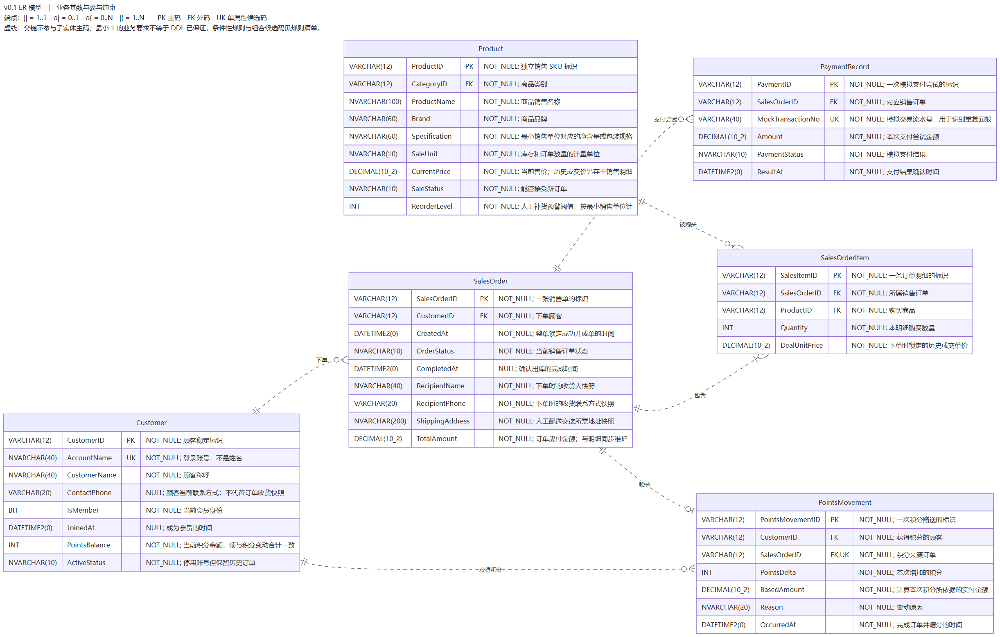

# Week5 ER 模型与 v0.1 设计审查

依据[第五周任务讲解](第五周任务讲解.md)，最初从 `origin/main` 的 `667259d`（第四周合并及服务器部署说明）创建第五周分支，于 2026-10-01 同步阶段提交修订，并按用户指示修复 review 问题后 squash 合入 `main`。本周把已有零食网店数据库反推为 ER 模型，解释标识、联系和参与条件，并用真实 SQL 核对模型与实现的差异。自动验证和用户合并授权分别记录，不将自动 review 记为学生逐项人工验收。

## 交付入口

| 交付 | 文件 |
| --- | --- |
| 讲解原文转换 | [第五周任务讲解](第五周任务讲解.md)，含第二阶段第5—9周安排 |
| ER 模型及完整字典 | [实体与数据字典](week5/er-model.md)，15 实体、107 属性、主码／候选码／外码和图例 |
| 可编辑源与清晰导出图 | [完整 Mermaid 源](week5/er-v0.1.mmd)、[完整 SVG](../result/week5/er-v0.1.svg)、[完整 PNG](../result/week5/er-v0.1.png)，另有采购、销售、库存三张分区图 |
| 业务规则与映射 | [规则清单](week5/business-rules.md)，23 个联系两端的最小／最大基数、2 条复合外码配对限制和11组业务不变量 |
| 问题与改进 | [v0.1 问题清单](week5/v0.1-issues.md)，12 项问题、证据、影响、保留理由及后续安排 |
| 验证与第二阶段报告素材 | 本文设计说明、演示路径、实际验证记录；[原始结果](../result/week5/README.md)及 [verify-er.sql](../sql/week5/verify-er.sql) |

## 设计思路

商品、类别、供应商、员工、顾客是可独立维护的主档；订单头表示一次完整业务，明细表示订单与商品的关联并承载数量和成交价。批次保存到货及保质期，锁定记录表示占用可售库存，库存流水表示实物数量变化。支付、积分、异常有各自的事件标识和生命周期，因此分别保存。详细的一行语义和字段对应见字典。

会员沿用顾客的可选身份属性，普通顾客也有顾客账号；当前没有匿名结账。一位员工与采购单可以有创建、审批、验收三种不同联系，不能合并成一个没有角色含义的“办理”。销售订单当前没有直接经办员工外码，员工通过出库流水和异常记录关联销售业务。

三个 M:N 分别通过采购明细、销售明细、库存锁定表示。当前无复合主码：各表采用独立 ID。销售／采购明细的订单商品组合是额外候选码，锁定的明细批次组合不是唯一键，因为需要表达多次事件。批次、销售单为复合外码准备的含主码 UNIQUE 是超码；支付的成功订单过滤唯一索引只在“成功”子集唯一，不能将订单号写为整张支付表的候选码。

图采用统一乌鸦脚表示法，标注业务上的最小参与数；单表 FK 不能保证父对象至少一个子对象，因此图中的订单 1..N 明细、批次 1..N 流水、销售明细 1..N 历史锁定是业务要求，当前 DDL 仍可能允许 0。锁定成功才成单，取消、换锁和出库后仍保留历史锁定；只有“有效锁定”子集可以为零。条件性参与（如已收货采购明细必须有批次、符合赠分资格的订单必须有积分）在规则表中明确，而不把所有订单都画成必有支付或积分。

历史成交价和收货快照记录下单当时事实，不能直接改成引用当前商品价／顾客信息；现存量、积分余额和订单总额则是需要同步维护的聚合值，列入第6周规范化与冗余取舍分析。第五周保留可复现 v0.1，尚未执行结构迁移。

## 图和数据库中的演示路径

先用完整图说明采购、库存、销售、积分之间的闭环，再打开各分区 SVG 放大字段和乌鸦脚端点。SVG 可缩放，PNG 是同一源的静态导出；图中全部字段可按英文名称查字典。



| 演示 | 图中的路径与实际数据 | 解释重点 |
| --- | --- | --- |
| 多商品订单 | C00 → ST00 → SI00/SI01 → S01/S00；10 × 4.40 + 2 × 2.00 = 48.00 | 一个订单有多条明细，一种商品可出现在不同订单；头表金额与行合计需要额外保证 |
| 会员购买 | C00 / C01 为会员；ST00 完成赠 48 分，ST01 的 16.50 元完成赠 16 分；分别关联 PM00 / PM01 | 赠分依据历史金额向下取整；订单与积分一般为 1:0..1，满足资格时必须有一条 |
| 普通顾客购买 | C02.IsMember = 0，ST02 买 S02 两袋，金额 11.00，已成功支付但待出库；没有积分记录 | 非会员也能下单；支付成功不表示已完成，不能提前赠分 |
| 库存查询 | S02 → PDI01 → B01；原入库 40、已出库 3、现存 37、有效锁定 2；B01 在 2026-09-18 到期 | 2026-09-17 可售 35；2026-09-18 起可售 0；不能简单用 37−2 作为任何日期的可售量 |
| 追溯供应商与员工 | B01 → PDI01 → PO00 → SUP00；PO00 创建 P02、审批 P01、验收 P00，出库经 IM05 关联 P00 | 联系具有业务角色；数据库引用存在不自动代表岗位和在职资格正确 |

本周实际查询日期为 2026-09-30，库存视图 B00/B01/B02 的可售量分别为 290/0/498。第三周固定 `2026-09-18` 的复核也得到这些数值。对 B01 的异常见 EX00、EX01：过期后保留待出库和锁定，不能虚记完成，也不把它当成普通未付款取消。

## 复现和实际验证

在 Windows PowerShell 的仓库根目录执行，选择新的独立本地库，避免覆盖已有数据库：

```powershell
$db = 'DataBaseLab_Week4_W5' + (Get-Date -Format 'yyyyMMddHHmmss')
powershell.exe -NoProfile -File .\scripts\Run-Week4.ps1 -Database $db
powershell.exe -NoProfile -File .\scripts\Test-Week5Model.ps1 -Database $db
powershell.exe -NoProfile -File .\scripts\Invoke-LabSql.ps1 -Database $db -InputFile .\sql\week3\04-verify.sql
```

库名沿用 Week4 执行器的校验范围，`W5` 后缀仅标明本周复现。`verify-er.sql` 需要完整的第三、四周对象和原样例，不能在有真实业务数据的库上当作通用健康检查。写入探针由管理连接执行，每例均回滚，发生错误也回滚，最后再次运行原复核。

2026-09-30 在 SQL Server 2022 LocalDB 的 `DataBaseLab_Week4_W520260930194047` 实际得到：

| 检查 | 实际结果及证据 |
| --- | --- |
| 从空库重现最新 v0.1 | `WEEK4_PASS`；CRUD、18 项约束正反例、查询、三个视图和17项权限正反例通过；[基线日志](../result/week5/baseline-run.txt) |
| 目录与模型核对 | `CATALOG_PASS`：15 表、107 属性、25 FK；另外逐项比较实际目录、DDL 与完整图源的107个属性类型／空值、15个主码、10个 UNIQUE 和25个外码（27列配对），全部一致；[ER 验证日志](../result/week5/er-verification.txt)、[模型核对](../result/week5/model-check.txt) |
| 约束边界探针 | `ER_BOUNDARY_PASS`，9/9 符合现有实现；空销售／采购单、库存合计不一致、跨商品锁定、支付金额不一致均被接受，记录为缺口；重复订单商品 2627、重复成功支付 2601 均被拒绝；多次失败支付和同明细批次再锁定可表示 |
| 回滚后原样例复核 | `VERIFY_PASS`，15 表、46 行，逐表 SHA-256 与基线最终复核相同；[回滚后日志](../result/week5/after-probes.txt) |
| 图源与导出 | 完整图和3张分区图均由 Mermaid 11.12.0 成功渲染；已检查中文、字段、联系和图边界；SVG 保留缩放能力 |

探针中的 PASS 表示“实际约束行为与本报告记录一致”，不是说被接受的非法业务已经满足要求。结构和业务改进计划详见问题清单。上述均为自动核对和真实 SQL 执行；组内职责已在[分工表](../组内分工.md)登记。用户已授权 review 修复后合并，未提供额外学生逐项人工验收记录。

### 2026-10-01 同步后的复验

`main` 已包含六类角色、34 项权限案例及本人订单/积分过程。业务 ER 仍对应 `dbo` 下 15 张表、107 个属性、25 个外码；`customer_security.CustomerPrincipal` 是另一个 schema 中的权限辅助表，含 2 列、1 个主键和 1 个外码，单独计数。验证脚本同时检查业务目录和全库总数，不将这张辅助表画成新增业务实体，也不会忽略其他意外表。

本次复验结果见[2026-10-01 同步验证](../result/week5/sync-validation-20261001.md)。历史日志保留原日期和当时的 17 项权限结果，当前权限以 34 项复验为准。

## 2026-10-01 review 修复与可复现核对

[Test-Week5Model.ps1](../scripts/Test-Week5Model.ps1) 先比较 DDL、已提交的目录基线和四张图的字段类型／空值／PK、FK、单属性 UK 标记，再运行 SQL 目录与边界探针。[verify-er.sql](../sql/week5/verify-er.sql) 即使直接执行，也会双向比较实际字段、15 个主码、10 个 UNIQUE、25 个外码的具体列及顺序，并检查成功支付的过滤唯一索引。删除 `UQ_ProductCategory_1` 会返回 51511，不能再凭数量通过。

只核对源文件：`powershell.exe -NoProfile -File .\scripts\Test-Week5Model.ps1 -SourceOnly`。业务模型确实变更时，先复核 DDL 和图，再显式加 `-UpdateCatalog` 更新 SQL 中标记的期望目录，并审阅差异；普通核对不会自动重写基线。跨库排序规则通过 `DATABASE_DEFAULT` 显式统一。

[Test-Week5Validation.ps1](../scripts/Test-Week5Validation.ps1) 验证检查器本身。先用 `Run-Week4.ps1` 创建名为 `DataBaseLab_Week4_W5Test` 加时间戳的独立库，再运行：

```powershell
powershell.exe -NoProfile -File .\scripts\Test-Week5Validation.ps1 -Database $db
```

该回归脚本仅接受 `W5Test`、`W5Fix` 或 `W5Review` 后缀的独立测试库；会暂时更改目录定义，在 finally 中恢复，并用临时图源测试错误标识和基数。实际结果为5项目录变化及2项图源变化均被拒绝，恢复后15表46行及数据摘要与基线相同。新证据见 [review 修复验证](../result/week5/review-validation-20261001.md)。历史日志继续保留其原始日期和验证范围。

## 编辑与重新导出

修改 `docs/week5/*.mmd` 后，可用 [Render-Week5Er.cjs](../scripts/Render-Week5Er.cjs) 重新生成四张 SVG／PNG，脚本会附上统一图例。需要 Node.js、Playwright 和 Edge；使用本次环境已有的 Codex 运行时，无需在仓库安装依赖：

```powershell
$runtimeNode = Join-Path $env:USERPROFILE '.cache\codex-runtimes\codex-primary-runtime\dependencies\node'
& "$runtimeNode\bin\node.exe" .\scripts\Render-Week5Er.cjs "$runtimeNode\node_modules" 'C:\Program Files (x86)\Microsoft\Edge\Application\msedge.exe'
```

其他电脑可把参数替换为自己的 Node、Playwright 包目录和 Chromium 系浏览器路径。渲染器从 CDN 加载固定版本 Mermaid 11.12.0，需要网络；源文件与业务数据在本地渲染。图的组合候选码、复合外码及条件性参与仍以字典／规则清单为补充，不能仅靠一张图解释所有业务限制。
